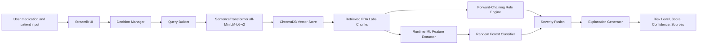
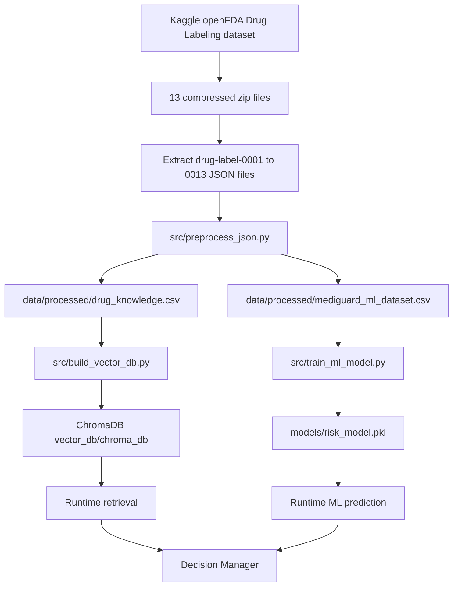
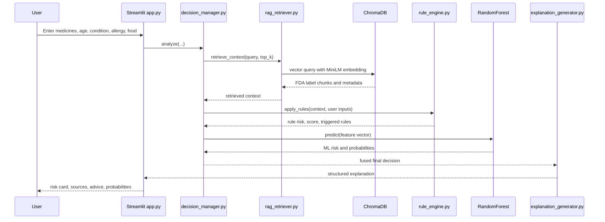
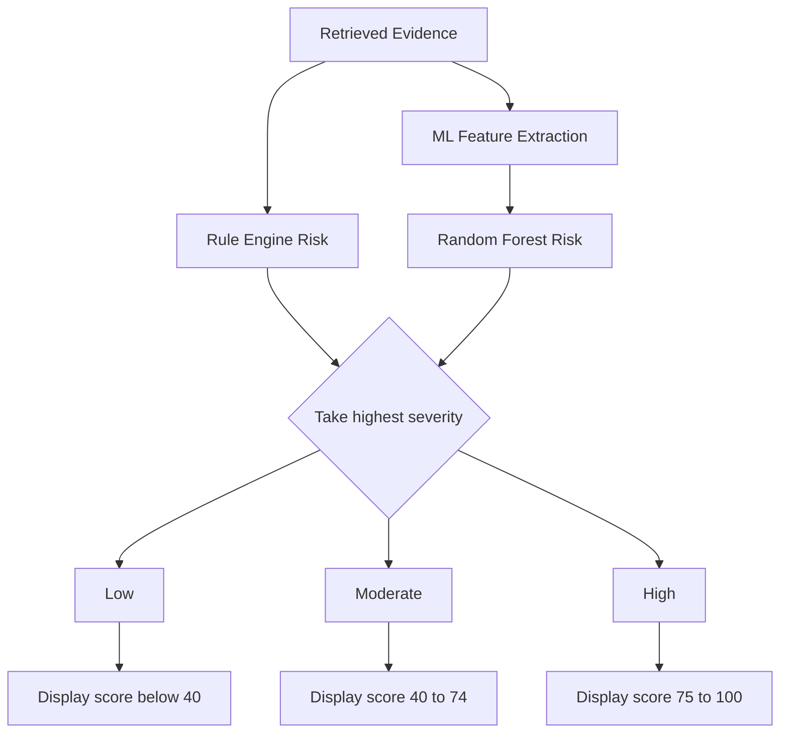
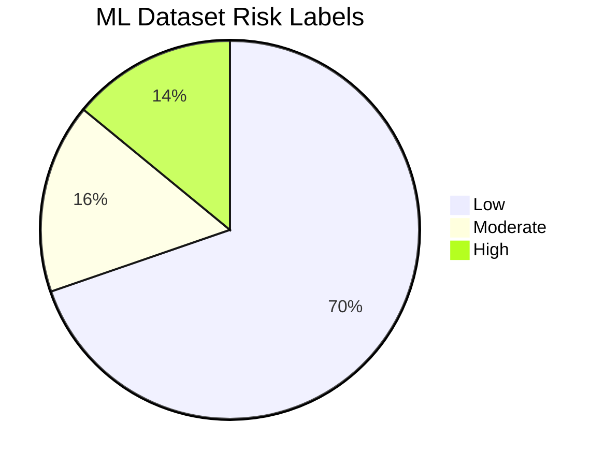
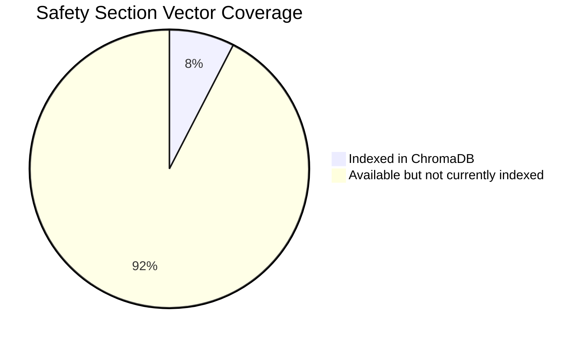
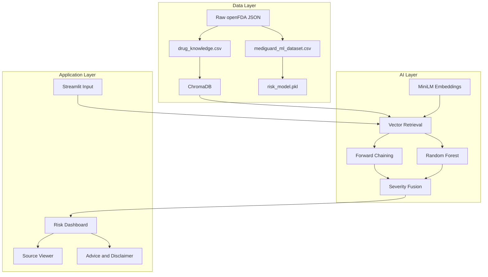

# MediGuard AI Drug Label Safety Agent

Analysis date: 2026-05-14  
Scope: local project at `d:\drug-labels\drug-labels\MediGuard_Project`

<p align="center">
  
  
  
  
  
</p>

<p align="center">
  <b>MediGuard</b> is a local hybrid AI medication-safety agent that combines vector retrieval, context-aware rule reasoning, and classical machine learning over FDA drug-label data.
</p>

---

## GitHub Setup Plan

This public repository is intended to contain the code, documentation, model logic, and reproducible build instructions. Very large data files should be provided separately by the project owner, not uploaded directly to GitHub.

### What Goes in the Public Repo

| Keep in GitHub | Reason |
|---|---|
| `app.py` | Main Streamlit application |
| `src/` | Preprocessing, retrieval, rules, training, decision, explanation logic |
| `requirements.txt` | Python dependency list |
| `README.md` | Main project descriptor and setup guide |
| `data/processed/medicine_rules.json` | Small rule description file |
| `data/processed/ml_metrics.txt` | Small model metrics report |
| `models/risk_model.pkl` | Small trained model artifact, about 1.8 MB |

### What the Project Owner Provides Separately

| Do not upload to GitHub | How users get it |
|---|---|
| `drug-label-0001-of-0013.json` through `drug-label-0013-of-0013.json` | Provided by owner, or downloaded/extracted from the Kaggle openFDA Drug Labeling dataset |
| `data/processed/drug_knowledge.csv` | Generated by `src/preprocess_json.py`, or provided in an artifact pack |
| `data/processed/mediguard_ml_dataset.csv` | Generated by `src/preprocess_json.py`, or provided in an artifact pack |
| `vector_db/chroma_db/` | Generated by `src/build_vector_db.py`, or provided in an artifact pack |
| `.rar`, `.zip`, `.7z` archives | Keep outside GitHub or attach as external release/download files if needed |
| Python virtual environments | Recreated locally with `python -m venv` |

### Setup Option A: Full Rebuild From Raw JSON

Use this when the user has the 13 raw JSON files and wants to rebuild everything locally.

```bash
git clone https://github.com/MaazSohail11/MediGuard-AI-Drug-Label-Safety-Agent.git
cd MediGuard-AI-Drug-Label-Safety-Agent

python -m venv .venv
.venv\Scripts\activate
python -m pip install --upgrade pip
pip install -r requirements.txt
```

On macOS/Linux, activate the environment with:

```bash
source .venv/bin/activate
```

Place the 13 extracted JSON files in one supported location.

Recommended for a normal cloned repo:

```text
<REPO>\
  data\
    raw_json\
      drug-label-0001-of-0013.json
      drug-label-0002-of-0013.json
      ...
      drug-label-0013-of-0013.json
```

Original local project layout, also supported:

```text
d:\drug-labels\drug-labels\
  MediGuard_Project\
  test_json_search.py
  drug-label-0001-of-0013.json
  drug-label-0002-of-0013.json
  ...
  drug-label-0013-of-0013.json
```

Then run:

```bash
python src/preprocess_json.py
python src/train_ml_model.py
python src/build_vector_db.py --reset
streamlit run app.py
```

For a full vector index instead of the default 60,000 chunks:

```bash
python src/build_vector_db.py --full --reset
```

### Setup Option B: Fast Start From Owner-Provided Artifacts

Use this when the project owner provides a ready-to-run artifact pack. This avoids long preprocessing and vector-building time.

First clone the repo and install dependencies:

```bash
git clone https://github.com/MaazSohail11/MediGuard-AI-Drug-Label-Safety-Agent.git
cd MediGuard-AI-Drug-Label-Safety-Agent

python -m venv .venv
.venv\Scripts\activate
python -m pip install --upgrade pip
pip install -r requirements.txt
```

On macOS/Linux, activate the environment with:

```bash
source .venv/bin/activate
```

Then extract the owner-provided artifact pack into the cloned repo so these paths exist:

```text
<REPO>\
  data\
    processed\
      drug_knowledge.csv
      mediguard_ml_dataset.csv
      ml_metrics.txt
      medicine_rules.json
  models\
    risk_model.pkl
  vector_db\
    chroma_db\
      chroma.sqlite3
      7ef58521-8a27-4fe6-9130-902b85a4fcb2\
```

Finally run:

```bash
streamlit run app.py
```

### Public Repo Rule

The public GitHub repo should stay lightweight and reproducible. The README explains where the raw JSON files come from, where owner-provided artifacts should be placed, and which commands rebuild the processed CSVs, trained model, and ChromaDB vector store.

---

## Visual Project Guide

### At a Glance

| Area | Current implementation |
|---|---|
| Application type | Local Streamlit medication-safety assistant |
| Dataset source | Kaggle `openFDA Drug Labeling - JSON Dataset` |
| Raw data format | 13 extracted `drug-label-*.json` files |
| Knowledge base | 1,252,539 processed FDA label section rows |
| Vector index | ChromaDB collection with 60,000 embedded chunks |
| Embedding model | `sentence-transformers/all-MiniLM-L6-v2` |
| Rule reasoning | Context-aware forward chaining |
| ML model | scikit-learn `RandomForestClassifier`, 200 trees |
| Final decision | Highest severity from rule engine and ML classifier |
| Generation model | None; explanations are deterministic templates |

### Repository Map

```text
MediGuard-AI-Drug-Label-Safety-Agent/
  app.py
  README.md
  requirements.txt
  LICENSE
  .gitignore
  data/
    processed/
      medicine_rules.json
      ml_metrics.txt
  models/
    risk_model.pkl
  src/
    preprocess_json.py
    build_vector_db.py
    rag_retriever.py
    rule_engine.py
    train_ml_model.py
    decision_manager.py
    explanation_generator.py
```

Generated or owner-provided artifact layout after setup:

```text
MediGuard-AI-Drug-Label-Safety-Agent/
  data/
    raw_json/
      drug-label-0001-of-0013.json
      ...
      drug-label-0013-of-0013.json
    processed/
      drug_knowledge.csv
      mediguard_ml_dataset.csv
  vector_db/
    chroma_db/
      chroma.sqlite3
      7ef58521-8a27-4fe6-9130-902b85a4fcb2/
```

Recommended raw-data location:

```text
d:\drug-labels\drug-labels\
  MediGuard_Project\
  test_json_search.py
  drug-label-0001-of-0013.json
  ...
  drug-label-0013-of-0013.json
```

### System Blueprint



### Data Build Pipeline



### Runtime Sequence



### Decision Fusion Map



### Data Footprint Charts

Current ML label distribution:



Current vector-index coverage of available safety-section rows:



Top model feature importances from the saved Random Forest:

```text
risk_score               | ############################## 0.456061
serious_keyword_count    | #################              0.259636
has_adverse_reactions    | ######                         0.095344
has_contraindications    | #####                          0.077628
has_overdosage_info      | ###                            0.052323
has_drug_interactions    | #                              0.020141
has_pediatric_warning    | #                              0.011519
has_pregnancy_warning    | #                              0.011322
has_geriatric_warning    | #                              0.008497
has_precautions          | #                              0.006496
has_warnings             | #                              0.001032
```

### Component Responsibility Map



### Quick Navigation

| Section | What to read it for |
|---|---|
| [1. Exact AI Stack Used](#1-exact-ai-stack-used) | Exact models, algorithms, and architecture components |
| [5. Dataset Source and Raw JSON Placement](#5-dataset-source-and-raw-json-placement) | Where the data came from and where raw JSON files belong |
| [8. RAG / Retrieval System](#8-rag--retrieval-system) | How vector search, ChromaDB, and MiniLM are used |
| [9. Forward-Chaining Rule Engine](#9-forward-chaining-rule-engine) | Rule logic, triggers, and scoring |
| [10. Random Forest ML Model](#10-random-forest-ml-model) | Saved model, parameters, metrics, and feature importances |
| [16. Important Technical Findings](#16-important-technical-findings) | Limitations, risks, and engineering findings |
| [17. Rebuild and Reproduce Pipeline](#17-rebuild-and-reproduce-pipeline) | Commands and raw-data placement before rebuild |

---

## 1. Exact AI Stack Used

This project is a hybrid AI medication-safety agent. It does not use a hosted LLM, GPT model, generative transformer, CNN, RNN, or fine-tuned medical language model. The deployed intelligence is a combination of retrieval, rule reasoning, and classical machine learning.

| Layer | Exact implementation | Model / algorithm | Where implemented |
|---|---|---|---|
| User interface | Streamlit app | Deterministic web UI | `app.py` |
| Retrieval / RAG | ChromaDB persistent vector database | Approximate nearest-neighbor vector search over embeddings, cosine space | `src/rag_retriever.py`, `src/build_vector_db.py` |
| Embedding model | `sentence-transformers/all-MiniLM-L6-v2` | MiniLM sentence-transformer bi-encoder, 384-dimensional dense embeddings | `src/rag_retriever.py`, `src/build_vector_db.py` |
| Reasoning engine | Hand-authored forward-chaining rules | IF/THEN rule matching with context/proximity checks | `src/rule_engine.py` |
| ML classifier | `sklearn.ensemble.RandomForestClassifier` | 200-tree Random Forest classifier using Gini impurity | `src/train_ml_model.py`, saved at `models/risk_model.pkl` |
| Decision fusion | Severity-rank fusion | `max(rule_risk, ml_risk)` by Low/Moderate/High rank | `src/decision_manager.py` |
| Explanation | Template generator | Deterministic text templates, no LLM generation | `src/explanation_generator.py` |

Important distinction: the project uses RAG-style retrieval, but it is not generative RAG. Retrieved label chunks are passed into a rule engine and a Random Forest feature extractor. No language model writes the answer.

## 2. High-Level System Purpose

MediGuard checks potential medication safety risks from FDA drug-label data. A user enters:

- primary medicine
- optional second medicine
- age
- symptoms
- medical condition
- allergy
- food or drink

The app retrieves relevant FDA label sections, applies safety rules, runs a Random Forest risk classifier, fuses the outputs, and displays:

- final risk level: `Low`, `Moderate`, or `High`
- risk score out of 100
- confidence score
- triggered rules
- ML class probabilities
- retrieved FDA label sources
- advice and follow-up questions

## 3. Runtime Architecture

Runtime flow:

```text
User input in Streamlit
  -> decision_manager.analyze(...)
  -> build one or more retrieval queries
  -> embed query with sentence-transformers/all-MiniLM-L6-v2
  -> query ChromaDB collection drug_labels
  -> retrieve FDA label chunks and metadata
  -> apply forward-chaining rule engine
  -> extract ML features from retrieved chunks
  -> RandomForestClassifier predicts risk class and probabilities
  -> decision fusion picks the highest severity between rules and ML
  -> explanation_generator creates display text
  -> Streamlit renders result
```

Main files:

| File | Role |
|---|---|
| `app.py` | Streamlit UI, input form, displays risk result, rules, probabilities, sources, and disclaimer. |
| `src/decision_manager.py` | Orchestrates retrieval, rule engine, ML prediction, and final risk fusion. |
| `src/rag_retriever.py` | Loads ChromaDB and embedding model, embeds queries, returns top-k chunks. |
| `src/rule_engine.py` | Applies context-aware forward-chaining safety rules. |
| `src/train_ml_model.py` | Trains and saves the Random Forest model. |
| `src/build_vector_db.py` | Builds the local ChromaDB vector store from processed FDA label sections. |
| `src/preprocess_json.py` | Converts raw openFDA JSON files into CSV datasets. |
| `src/explanation_generator.py` | Converts raw decision output into user-facing text and source summaries. |

## 4. Data and Artifact Inventory

| Artifact | Current path | Current size / count | What it does |
|---|---:|---:|---|
| Processed RAG knowledge CSV | `data/processed/drug_knowledge.csv` | 753,641,376 bytes; 1,252,539 rows | Section-level FDA label text used to build the vector database. |
| Processed ML dataset | `data/processed/mediguard_ml_dataset.csv` | 23,797,035 bytes; 242,198 rows | Drug-level feature table used to train the Random Forest. |
| ML metrics report | `data/processed/ml_metrics.txt` | text report | Stores model accuracy, classification report, confusion matrix, and feature importances. |
| Rule JSON | `data/processed/medicine_rules.json` | present | Describes an older/static rule set, but is not imported by the running code. The actual rules are hard-coded in `src/rule_engine.py`. |
| Serialized ML model | `models/risk_model.pkl` | 1,836,449 bytes | Saved scikit-learn Random Forest model loaded at runtime. |
| Chroma SQLite metadata | `vector_db/chroma_db/chroma.sqlite3` | 307,707,904 bytes | Persistent metadata and documents for ChromaDB. |
| Chroma HNSW vector files | `vector_db/chroma_db/7ef58521-8a27-4fe6-9130-902b85a4fcb2/` | present | Local persisted HNSW vector index files. |
| Vector DB archive | `vector_db.rar` | 155,372,890 bytes | Compressed copy of vector DB. |
| Project/raw-data archive | `d:\drug-labels\drug-labels.rar` | 356,593,627 bytes | Archive at repository root, likely used to preserve raw/project files. |

## 5. Dataset Source and Raw JSON Placement

The data used for this project is the Kaggle dataset:

```text
openFDA Drug Labeling - JSON Dataset
https://www.kaggle.com/datasets/ddrbcn/openfda-drug-labeling/data
```

This dataset contains structured drug-labeling information, meaning FDA labels provided by DailyMed and made available through the openFDA Drug Labeling endpoint. The records follow the same general structure returned by the openFDA `/drug/label` API.

The dataset includes 13 compressed `.zip` files containing drug-label records in JSON format. After extraction, the expected raw files are:

```text
drug-label-0001-of-0013.json
drug-label-0002-of-0013.json
...
drug-label-0013-of-0013.json
```

For this project layout, those raw JSON files should be stored in the outer `drug-labels` folder:

```text
d:\drug-labels\drug-labels\
```

That is the same folder that contains:

```text
MediGuard_Project\
test_json_search.py
```

This placement matters because `src/preprocess_json.py` first checks:

- `data/raw_json/drug-label-*.json`

- then falls back to the parent directory of `MediGuard_Project`, which is `d:\drug-labels\drug-labels`

So the recommended raw-data layout is:

```text
d:\drug-labels\drug-labels\
  MediGuard_Project\
  test_json_search.py
  drug-label-0001-of-0013.json
  drug-label-0002-of-0013.json
  ...
  drug-label-0013-of-0013.json
```

Alternative supported layout:

```text
d:\drug-labels\drug-labels\MediGuard_Project\data\raw_json\
  drug-label-0001-of-0013.json
  ...
  drug-label-0013-of-0013.json
```

The current loose JSON files are not present in `d:\drug-labels\drug-labels`; only generated processed outputs and archives are present. Re-running preprocessing requires restoring the `drug-label-0001-of-0013.json` through `drug-label-0013-of-0013.json` files into one of those expected locations.

## 6. Processed Dataset Details

### 6.1 `drug_knowledge.csv`

Purpose: section-level text table for retrieval and vector database construction.

Rows: 1,252,539  
Unique source IDs: 235,150  
Unique drug names: 36,834  
Columns:

- `source_id`
- `drug_name`
- `brand_name`
- `generic_name`
- `route`
- `section_name`
- `section_text`

Section counts:

| Section | Rows |
|---|---:|
| `indications_and_usage` | 229,505 |
| `dosage_and_administration` | 229,021 |
| `warnings` | 186,546 |
| `adverse_reactions` | 84,688 |
| `contraindications` | 82,862 |
| `overdosage` | 77,806 |
| `pediatric_use` | 63,832 |
| `pregnancy` | 63,419 |
| `drug_interactions` | 63,163 |
| `geriatric_use` | 53,908 |
| `precautions` | 44,713 |
| `warnings_and_cautions` | 42,382 |
| `boxed_warning` | 30,694 |

Route counts, top values:

| Route | Rows |
|---|---:|
| blank / missing | 795,039 |
| `ORAL` | 297,026 |
| `TOPICAL` | 79,923 |
| `INTRAVENOUS` | 29,513 |
| `INTRAMUSCULAR` | 12,636 |
| `OPHTHALMIC` | 7,676 |
| `DENTAL` | 4,001 |
| `SUBCUTANEOUS` | 3,643 |
| `RESPIRATORY (INHALATION)` | 3,364 |
| `SUBLINGUAL` | 3,110 |

Text handling: `src/preprocess_json.py` caps each `section_text` at 800 characters. This keeps vector chunks small, but it can remove later parts of long FDA label sections.

### 6.2 `mediguard_ml_dataset.csv`

Purpose: one row per drug-label record for training the Random Forest risk classifier.

Rows: 242,198  
Unique source IDs: 242,198  
Unique drug names: 37,484  
Columns:

- identity columns: `source_id`, `drug_name`, `brand_name`, `generic_name`, `route`
- binary section flags:
  - `has_contraindications`
  - `has_warnings`
  - `has_precautions`
  - `has_drug_interactions`
  - `has_adverse_reactions`
  - `has_pediatric_warning`
  - `has_geriatric_warning`
  - `has_pregnancy_warning`
  - `has_overdosage_info`
- numeric risk features:
  - `serious_keyword_count`
  - `risk_score`
- label:
  - `risk_level`

Label distribution:

| Label | Rows |
|---|---:|
| `Low` | 168,849 |
| `Moderate` | 39,311 |
| `High` | 34,038 |

Route counts, top values:

| Route | Rows |
|---|---:|
| blank / missing | 160,918 |
| `ORAL` | 45,414 |
| `TOPICAL` | 23,173 |
| `INTRAVENOUS` | 3,179 |
| `INTRAMUSCULAR` | 1,347 |
| `OPHTHALMIC` | 1,293 |
| `DENTAL` | 1,262 |
| `RESPIRATORY (INHALATION)` | 1,210 |
| `CUTANEOUS` | 792 |
| `SUBLINGUAL` | 776 |

## 7. Preprocessing Logic

Implemented in `src/preprocess_json.py`.

### 7.1 Raw JSON parsing

The parser reads `drug-label-*.json` files. For each record in `results`, it extracts:

- `openfda.brand_name`
- `openfda.generic_name`
- `openfda.route`
- selected FDA label text sections

Drug name selection:

```text
drug_name = first brand_name
         or first generic_name
         or "Unknown"
```

Source ID format:

```text
{json_file_stem}_{record_index}
```

Example:

```text
drug-label-0001-of-0013_0
```

### 7.2 Knowledge-base rows

For each record, the code creates one knowledge row for every non-empty section in this list:

- `indications_and_usage`
- `dosage_and_administration`
- `contraindications`
- `warnings`
- `warnings_and_cautions`
- `boxed_warning`
- `precautions`
- `drug_interactions`
- `adverse_reactions`
- `pediatric_use`
- `geriatric_use`
- `pregnancy`
- `overdosage`

Only text longer than 20 characters is retained. Each retained section is truncated to 800 characters.

### 7.3 ML risk-label generation

The ML labels are not human-annotated labels. They are generated by keyword heuristics in `compute_risk(record)`.

High-risk keyword list:

```text
fatal, death, life-threatening, contraindicated, do not use,
serotonin syndrome, anaphylaxis, bleeding, liver failure,
renal failure, overdose, toxicity, seizure, rhabdomyolysis,
hypersensitivity, not recommended
```

Moderate-risk keyword list:

```text
warning, caution, avoid, monitor, adverse reaction,
consult, ask a doctor, pregnancy, pediatric, geriatric,
dose adjustment
```

Risk formula:

```text
high_count = number of high-risk keywords found
mod_count = number of moderate-risk keywords found
raw = high_count * 2 + mod_count
MAX_POSSIBLE = 16 * 2 + 11 = 43
risk_score = raw / 43
```

Label thresholds:

```text
High     if risk_score >= 0.55
Moderate if risk_score >= 0.30
Low      otherwise
```

This means the ML classifier learns labels produced by the same keyword-risk system that also supplies `risk_score` as a feature. The reported 100% accuracy is therefore not evidence of clinical accuracy; it mostly proves the model can reproduce the preprocessing heuristic.

## 8. RAG / Retrieval System

Implemented in:

- `src/build_vector_db.py`
- `src/rag_retriever.py`

### 8.1 Embedding model

Exact embedding model:

```text
sentence-transformers/all-MiniLM-L6-v2
```

Architecture role:

- transformer sentence embedding model
- MiniLM-based bi-encoder
- converts text into 384-dimensional dense vectors
- used for semantic similarity search
- not fine-tuned in this project
- not used to classify risk directly
- not used to generate text

### 8.2 Vector database

Exact vector store:

```text
ChromaDB PersistentClient
path = vector_db/chroma_db
collection = drug_labels
metadata = {"hnsw:space": "cosine"}
```

Current Chroma collection:

| Property | Value |
|---|---|
| Collection name | `drug_labels` |
| Collection ID | `c8a42ce7-d0e9-4b5b-a31b-5f0904662be1` |
| Vector segment ID | `7ef58521-8a27-4fe6-9130-902b85a4fcb2` |
| Metadata segment ID | `85f074b5-ff0b-4008-9831-b0698016361e` |
| Embedding dimension | 384 |
| Distance space | cosine |
| Current embedded chunks | 60,000 |
| HNSW max neighbors | 16 |
| HNSW ef construction | 100 |
| HNSW ef search | 100 |

### 8.3 What goes into the vector DB

`build_vector_db.py` embeds only safety-relevant sections:

- `warnings`
- `warnings_and_cautions`
- `boxed_warning`
- `contraindications`
- `drug_interactions`
- `precautions`
- `adverse_reactions`
- `overdosage`
- `pediatric_use`
- `geriatric_use`
- `pregnancy`

The full processed knowledge CSV contains 794,013 rows in these safety sections, but the current vector DB contains only 60,000 embedded chunks because the default build command limits indexing to 60,000 rows unless `--full` is used.

This is a major coverage detail:

```text
Available safety-section rows in CSV: 794,013
Currently indexed in ChromaDB:         60,000
Coverage of safety rows:               about 7.6%
```

The README phrase "260,000+ FDA drug-label records" describes the broader dataset goal, not the current vector count. The current retriever searches 60,000 embedded chunks.

### 8.4 Document format

Each row is embedded as:

```text
Drug: {drug_name}
Section: {section_name}
Text: {section_text}
```

Metadata stored per vector:

- `source_id`
- `drug_name`
- `brand_name`
- `generic_name`
- `section_name`
- `route`

### 8.5 Retrieval algorithm at runtime

`retrieve_context(query, top_k)`:

1. Lazy-loads ChromaDB from `vector_db/chroma_db`.
2. Lazy-loads `sentence-transformers/all-MiniLM-L6-v2`.
3. Encodes the query into a 384-dimensional vector.
4. Queries ChromaDB with `query_embeddings`.
5. Requests `documents`, `metadatas`, and `distances`.
6. Returns a list of chunks with rounded cosine distance.

Default in `rag_retriever.py`:

```text
top_k = 5
```

Default in `decision_manager.analyze(...)`:

```text
top_k = 7
```

Additional focused retrievals are added:

- if `medicine_2` exists, an interaction query retrieves 4 more chunks
- if `allergy` exists, an allergy query retrieves 3 more chunks

The manager deduplicates extra chunks by `(source_id, section_name)`.

### 8.6 Retrieval query construction

For a primary medicine only:

```text
{medicine_1} warnings contraindication {condition} {allergy} {food} {symptoms}
```

For two medicines:

```text
{medicine_1} {medicine_2} interaction contraindication warnings {condition} {allergy} {food} {symptoms}
```

Focused second-medicine query:

```text
{medicine_1} {medicine_2} contraindication interaction serotonin syndrome
```

Focused allergy query:

```text
{medicine_1} allergic {allergy} contraindication hypersensitivity do not use
```

Noise values skipped:

```text
"", "none", "n/a", "no", "na", "nil", "not applicable"
```

## 9. Forward-Chaining Rule Engine

Implemented in `src/rule_engine.py`.

The rule engine is context-aware and forward-chaining. It scans retrieved FDA label chunks and user inputs, fires rules, counts high/moderate hits, and returns a rule-level risk.

### 9.1 Rule categories

The engine applies rules in this order:

1. Always-High phrases
2. Context-dependent High phrases
3. Always-Moderate phrases
4. Fallback Moderate for unhandled high-risk phrases
5. Patient-context Moderate signals
6. Score and final rule risk level

### 9.2 Always-High rules

These can produce `High` without requiring proximity to the user's specific input:

| Rule ID | Trigger |
|---|---|
| `RULE_FATAL` | `fatal`, except downgraded qualifiers such as `rarely fatal` |
| `RULE_DEATH` | `death` |
| `RULE_LIFE_THREATENING` | `life-threatening` |
| `RULE_SEROTONIN_SYN` | `serotonin syndrome` |
| `RULE_RHABDO` | `rhabdomyolysis` |

### 9.3 Context-dependent High rules

These require a trigger phrase to appear near user-specific terms. The proximity window is 400 characters.

Examples:

| Rule ID | Logic |
|---|---|
| `RULE_CONTRAINDICATED_M2` | `contraindicated` near terms from `medicine_2` |
| `RULE_DO_NOT_USE_M2` | `do not use` near terms from `medicine_2` |
| `RULE_DO_NOT_USE_ALLERGY` | `do not use` near allergy terms |
| `RULE_DO_NOT_USE_PREGNANCY` | pregnancy condition and `do not use` near pregnancy terms |
| `RULE_DO_NOT_USE_FOOD` | `do not use` near food terms |
| `RULE_DO_NOT_USE_PEDIATRIC` | age under 12 and pediatric context |
| `RULE_DO_NOT_USE_GERIATRIC` | age at least 65 and geriatric context |
| `RULE_ANAPHYLAXIS_ALLERGY` | `anaphylaxis` near allergy terms |
| `RULE_HYPERSENSITIVITY_ALLERGY` | `hypersensitivity` near allergy terms |
| `RULE_NOT_RECOMMENDED_M2` | `not recommended` near `medicine_2` |
| `RULE_LIVER_CONTEXT` | liver-damage language near alcohol or liver-condition terms |
| `RULE_BLEEDING_ANTICOAG` | bleeding language near anticoagulant or blood-thinner terms |
| `RULE_PREGNANCY_CONTRA` | pregnancy contraindication phrases when condition includes pregnancy |

### 9.4 Always-Moderate rules

| Rule ID | Trigger |
|---|---|
| `RULE_CAUTION` | `caution` |
| `RULE_MONITOR` | `monitor` |
| `RULE_AVOID` | `avoid` |
| `RULE_ASK_DOCTOR` | `ask a doctor` |
| `RULE_CONSULT` | `consult` |
| `RULE_ADV_REACT` | `adverse reaction` |
| `RULE_USE_CAUTION` | `use caution` |

### 9.5 Fallback Moderate rules

Potentially severe terms are downgraded to Moderate if they are present in the FDA text but do not match the user's specific context:

- `do not use`
- `contraindicated`
- `anaphylaxis`
- `hypersensitivity`
- `not recommended`
- `liver failure`
- `renal failure`
- `bleeding`
- `seizure`

This is intended to reduce false High classifications from generic warnings.

### 9.6 Patient-context Moderate rules

The rule engine also adds Moderate hits for:

- age at least 65 with geriatric text
- age under 12 with pediatric text
- food/drink term found in retrieved text
- medical condition term found in retrieved text
- second medicine mentioned in retrieved text without a stronger context-High match

### 9.7 Rule score

Rule scoring:

```text
raw = high_hits * 20 + mod_hits * 5
```

Rule risk:

```text
High:
  if high_hits >= 1
  score = max(75, min(100, raw))

Moderate:
  if no high hits and mod_hits >= 1
  score = max(40, min(74, raw))

Low:
  if no high/moderate hits
  score = min(35, raw)
```

The returned `rule_score` is normalized from 0 to 1.

## 10. Random Forest ML Model

Implemented in:

- training: `src/train_ml_model.py`
- runtime load/predict: `src/decision_manager.py`
- artifact: `models/risk_model.pkl`

### 10.1 Exact saved model

Loaded model type:

```text
sklearn.ensemble._forest.RandomForestClassifier
```

Classes:

```text
['High', 'Low', 'Moderate']
```

Number of input features:

```text
11
```

Training parameters from the saved model:

| Parameter | Value |
|---|---|
| `n_estimators` | 200 |
| `criterion` | `gini` |
| `max_depth` | 15 |
| `min_samples_leaf` | 5 |
| `min_samples_split` | 2 |
| `max_features` | `sqrt` |
| `bootstrap` | `True` |
| `class_weight` | `balanced` |
| `random_state` | 42 |
| `n_jobs` | -1 |
| `oob_score` | `False` |

Tree statistics from the saved artifact:

| Statistic | Value |
|---|---:|
| Number of trees | 200 |
| Min tree depth | 3 |
| Average tree depth | 9.76 |
| Max tree depth | 15 |
| Min leaves per tree | 4 |
| Average leaves per tree | 50.30 |
| Max leaves per tree | 157 |

### 10.2 Features

The model uses these exact features:

```text
has_contraindications
has_warnings
has_precautions
has_drug_interactions
has_adverse_reactions
has_pediatric_warning
has_geriatric_warning
has_pregnancy_warning
has_overdosage_info
serious_keyword_count
risk_score
```

At training time, these features come from `mediguard_ml_dataset.csv`.

At runtime, these features are re-derived from the retrieved RAG chunks in `_extract_ml_features(context)`, not by directly looking up the original drug-level row.

Runtime feature extraction:

- joins all retrieved chunk text
- checks which section names are present
- counts high-risk keywords
- counts moderate-risk keywords
- computes a runtime `risk_score = min(1.0, raw / 43)`

### 10.3 Training/test split

From `ml_metrics.txt`:

| Metric | Value |
|---|---:|
| Total records | 242,198 |
| Train records | 169,538 |
| Test records | 72,660 |
| Split | 70/30 |
| Stratified | yes |
| Random state | 42 |

### 10.4 Reported metrics

From `data/processed/ml_metrics.txt`:

| Metric | Value |
|---|---:|
| Accuracy | 1.0000 |
| High precision / recall / F1 | 1.00 / 1.00 / 1.00 |
| Low precision / recall / F1 | 1.00 / 1.00 / 1.00 |
| Moderate precision / recall / F1 | 1.00 / 1.00 / 1.00 |

Confusion matrix, rows actual and columns predicted, labels `Low`, `Moderate`, `High`:

```text
[[50655     0     0]
 [    0 11793     0]
 [    0     0 10212]]
```

### 10.5 Feature importances

| Feature | Importance |
|---|---:|
| `risk_score` | 0.456061 |
| `serious_keyword_count` | 0.259636 |
| `has_adverse_reactions` | 0.095344 |
| `has_contraindications` | 0.077628 |
| `has_overdosage_info` | 0.052323 |
| `has_drug_interactions` | 0.020141 |
| `has_pediatric_warning` | 0.011519 |
| `has_pregnancy_warning` | 0.011322 |
| `has_geriatric_warning` | 0.008497 |
| `has_precautions` | 0.006496 |
| `has_warnings` | 0.001032 |

### 10.6 ML interpretation

This Random Forest is best understood as a heuristic risk-label replicator, not a clinically validated safety predictor.

Reason:

- the labels are created by keyword rules
- `risk_score`, a direct product of the label-generation heuristic, is included as an input feature
- the model reports 100% test accuracy, which is expected when the target is mostly encoded in the features

The model is still useful inside this project as a secondary signal, but it should not be described as independently learning medication safety from real-world outcomes.

## 11. Decision Manager and Fusion Logic

Implemented in `src/decision_manager.py`.

The decision manager does five main things:

1. Load `models/risk_model.pkl`.
2. Build RAG queries from user input.
3. Retrieve FDA label chunks.
4. Apply rule engine.
5. Run ML prediction and fuse rule/ML risk.

### 11.1 Risk rank

The final severity rank is:

```text
Low      = 0
Moderate = 1
High     = 2
```

Final risk:

```text
final_rank = max(rank(rule_risk), rank(ml_prediction))
final_risk = rank_to_name(final_rank)
```

This means either the rule engine or the ML model can escalate the final result. The lower-risk component cannot downgrade the higher-risk component.

### 11.2 Confidence

The ML model produces probabilities. The largest class probability is `ml_conf`.

Confidence rule:

```text
if rule_risk == ml_prediction:
    confidence = ml_conf * 0.95
else:
    confidence = ml_conf * 0.80
```

This means the displayed confidence is mostly ML confidence, lightly penalized when rules and ML disagree.

### 11.3 Final risk score

The raw displayed score is a 50/50 blend:

```text
raw_score = rule_score * 0.5 + ml_feature_risk_score * 0.5
```

Then it is clamped into the final risk band:

```text
High:     0.75 to 1.00
Moderate: 0.40 to 0.74
Low:      0.00 to 0.39
```

This guarantees that a `High` result is displayed as at least 75/100, a `Moderate` result at least 40/100, and a `Low` result below 40/100.

## 12. Explanation Layer

Implemented in `src/explanation_generator.py`.

This layer does not call a language model. It creates deterministic output from templates and the decision dictionary.

It returns:

- `risk_level`
- `risk_icon`
- `risk_score`
- `confidence`
- `warning`
- `why`
- `advice`
- `sources`
- `follow_up_questions`
- `rule_result`
- `ml_result`
- `triggered_rules`
- `disclaimer`

Source names are deduplicated from retrieved context and formatted as:

```text
{Section Title} ({Drug Name})
```

Only the first four rule reasons are concatenated into the main "why" text.

## 13. Streamlit Application

Implemented in `app.py`.

The app:

- sets a wide Streamlit layout
- lazy-loads `analyze` and `generate_explanation` with `st.cache_resource`
- collects patient and medication inputs in the sidebar
- requires `medicine_1`
- runs the full analysis on button click
- displays risk metrics, warnings, advice, sources, triggered rules, ML probabilities, retrieved chunks, and feedback buttons

The UI is a local Streamlit app, not an API server.

Launch command:

```bash
streamlit run app.py
```

## 14. End-to-End Example Observed in Current Project

Command run locally through `decision_manager.analyze(...)`:

```text
medicine_1 = buspirone
medicine_2 = MAOI
age = 45
condition = depression
allergy = none
food = grapefruit juice
top_k = 5
```

Built query:

```text
buspirone MAOI interaction contraindication warnings depression grapefruit juice
```

Observed result:

| Output | Value |
|---|---|
| Final risk | `High` |
| Final risk score | `0.75` |
| Confidence score | `0.7941` |
| Rule risk | `High` |
| Rule score | `0.75` |
| ML risk | `Low` |
| ML confidence | `0.9926402662078925` |
| Retrieved context chunks after merges | 9 |

Triggered rules included:

- `RULE_LIFE_THREATENING`
- `RULE_SEROTONIN_SYN`
- `RULE_CONTRAINDICATED_M2`
- `RULE_M1_IN_LABEL`
- `RULE_CAUTION`
- `RULE_CONDITION_MATCH`

ML probabilities:

```text
High:     0.0000
Low:      0.9926
Moderate: 0.0074
```

Runtime ML features extracted from retrieved chunks:

```text
has_contraindications: 1
has_warnings: 1
has_precautions: 0
has_drug_interactions: 0
has_adverse_reactions: 0
has_pediatric_warning: 0
has_geriatric_warning: 0
has_pregnancy_warning: 0
has_overdosage_info: 0
serious_keyword_count: 3
risk_score: 0.186
```

Interpretation: the final answer is `High` because the rule engine found high-risk evidence, even though the Random Forest predicted `Low`. This confirms that rule severity dominates when it is higher than ML severity.

## 15. What Is Not Used

This project does not currently use:

- OpenAI API
- GPT models
- LangChain
- LlamaIndex
- a generative LLM
- a medical BERT classifier
- a cross-encoder reranker
- fine-tuning of `all-MiniLM-L6-v2`
- neural sequence classification for risk labels
- reinforcement learning
- dosage calculation models
- pharmacokinetic/pharmacodynamic simulation
- RxNorm normalization
- an external drug-drug interaction API
- a clinical validation set

## 16. Important Technical Findings

### 16.1 Current vector DB is a partial index

`drug_knowledge.csv` contains 794,013 safety-section rows, but current ChromaDB contains 60,000 vectors. Retrieval is therefore limited to the first 60,000 safety rows selected by `df.head(args.max)` in `build_vector_db.py`.

To index all safety sections:

```bash
python src/build_vector_db.py --full --reset
```

This may take significant time on CPU.

### 16.2 ML metrics are inflated by label leakage

The target label is generated from `risk_score`, and `risk_score` is also an input feature. The Random Forest accuracy of 1.0000 should not be presented as proof of clinical performance.

Better wording:

```text
The Random Forest reproduces the project's heuristic risk labeling with perfect held-out accuracy on the generated dataset.
```

Avoid wording like:

```text
The model is clinically 100% accurate.
```

### 16.3 `medicine_rules.json` is not active runtime configuration

The file `data/processed/medicine_rules.json` exists, but no source file imports or reads it. The active rules are hard-coded in `src/rule_engine.py`.

If the project expects editable JSON-based rules, the rule engine needs to be refactored to load that file.

### 16.4 Retrieval metadata quality has gaps

Many rows have blank route values or `drug_name = Unknown`. In the observed buspirone/MAOI run, the top retrieved chunks had `drug_name = Unknown` even though the text matched the query. This comes from missing `openfda` metadata in some source records.

That affects source display quality and can make explanations less trustworthy to users, even when retrieved text is relevant.

### 16.5 Runtime ML features depend on retrieval quality

The Random Forest was trained on full drug-level records. At runtime, features are extracted only from retrieved chunks. If retrieval misses key sections, the ML feature vector may understate risk.

Example from the observed buspirone/MAOI run:

- rule engine returned `High`
- ML returned `Low`
- runtime feature vector had only contraindication and warning sections, no drug-interaction/adverse-reaction/pregnancy/etc. flags

This is why the fusion logic's high-risk rule priority is important.

### 16.6 This is an educational safety assistant, not a medical device

The app includes a disclaimer, and the implementation supports that framing. It should not be deployed as a clinical decision system without:

- clinically curated labels
- validation against expert-reviewed cases
- drug-name normalization
- interaction-specific evidence sources
- audit logs
- safety monitoring
- regulatory review where applicable

## 17. Rebuild and Reproduce Pipeline

Expected build order from README:

```bash
pip install -r requirements.txt
python src/preprocess_json.py
python src/train_ml_model.py
python src/build_vector_db.py
streamlit run app.py
```

Before running `python src/preprocess_json.py`, extract the 13 Kaggle `.zip` files and place the raw `drug-label-0001-of-0013.json` through `drug-label-0013-of-0013.json` files in:

```text
d:\drug-labels\drug-labels\
```

This is the outer project folder containing `MediGuard_Project` and `test_json_search.py`.

For a full vector build:

```bash
python src/build_vector_db.py --full --reset
```

For a smaller demo vector build:

```bash
python src/build_vector_db.py --max 20000 --reset
```

Dependencies:

```text
pandas
numpy
scikit-learn
streamlit
chromadb
sentence-transformers
joblib
tqdm
```

## 18. Recommended Improvements

Priority recommendations:

1. Restore the raw JSON files from the Kaggle openFDA Drug Labeling dataset into `d:\drug-labels\drug-labels`, next to `MediGuard_Project` and `test_json_search.py`, or document the alternate `data/raw_json` layout.
2. Rebuild ChromaDB with `--full --reset` if the project claim is broad FDA-label coverage.
3. Replace or supplement heuristic ML labels with expert-reviewed medication-safety labels.
4. Remove `risk_score` from ML features when evaluating true generalization, or clearly label the model as a heuristic reproducer.
5. Add drug-name normalization using RxNorm or another medication terminology source.
6. Add a reranking step for retrieved chunks, especially for drug-drug interaction queries.
7. Add metadata filters for drug name, generic name, route, and section when available.
8. Move rule definitions into a real runtime configuration file if `medicine_rules.json` is meant to be editable.
9. Add test cases for known high-risk examples, benign examples, allergies, pediatric/geriatric cases, pregnancy, alcohol/liver warnings, and anticoagulant bleeding interactions.
10. Add a data card/model card documenting data source, extraction date, limitations, known biases, and validation status.

## 19. One-Line Technical Summary

MediGuard is a local Streamlit-based hybrid AI agent that retrieves FDA label chunks using `sentence-transformers/all-MiniLM-L6-v2` embeddings in ChromaDB, reasons over retrieved text with a context-aware forward-chaining rule engine, uses a scikit-learn 200-tree Random Forest trained on heuristic label features as a secondary classifier, and fuses rule/ML outputs by selecting the highest risk severity.
